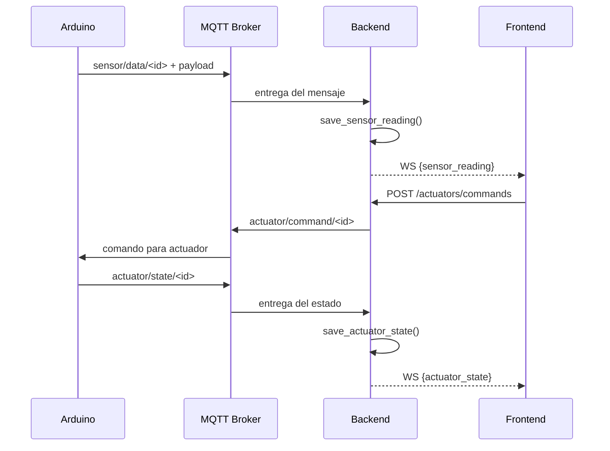

# 🏠 IoT House TEC — Documentación Oficial de Comunicación MQTT + Backend

Este documento describe **todos los flujos de mensajes** entre:

* Arduino
* Backend (FastAPI + Python + MySQL)
* MQTT Broker
* Frontend (WebSockets)

Incluye los **tópicos, payloads, validaciones y efectos en el sistema**, basándose en el código real del proyecto.

---

# 📡 Arquitectura General

```
Arduino  <──>  MQTT Broker  <──>  Backend (FastAPI + MQTT client)  <──>  Frontend (WebSockets)
```

El backend:

* Escucha datos de sensores
* Guarda en base de datos
* Envía eventos al frontend vía WebSockets
* Recibe comandos del frontend
* Publica comandos hacia Arduino
* Recibe estados de actuadores y los guarda

---

# 📘 Estructura General de Topics MQTT

| Tipo                    | Topic                                             | Dirección         | Función              |
| ----------------------- | ------------------------------------------------- | ----------------- | -------------------- |
| **Sensor → Server**     | `iot_house_tec/casa/sensor/data/<device_id>`      | Arduino → Backend | Lecturas de sensores |
| **Frontend → Actuador** | `iot_house_tec/casa/actuator/command/<device_id>` | Backend → Arduino | Enviar comandos      |
| **Actuador → Server**   | `iot_house_tec/casa/actuator/state/<device_id>`   | Arduino → Backend | Reporte de estado    |

---

# 🟩 CASO 1 — Arduino envía datos de sensores

## 📨 Topic MQTT

```
iot_house_tec/casa/sensor/data/<device_id>
```

## 📦 Payload JSON

```json
{
  "source": "arduino",
  "type": "sensor",
  "device_id": "<device_id>",
  "payload": {
    "<device_sensor_id>": <value>,
    "<device_sensor_id>": <value>
  }
}
```

## 🔧 Procesamiento en el backend

Fragmento relevante del código:

```python
if topic.startswith("iot_house_tec/casa/sensor/data/"):
    device_id = topic.split("/")[-1]
    payload = message.get("payload", {})

    for device_sensor_id, value in payload.items():
        save_sensor_reading({
            "device_id": device_id,
            "device_sensor_id": device_sensor_id,
            "value": value
        })

        normalized_msg = {
            "type": "sensor_reading",
            "device_id": device_id,
            "sensor_id": device_sensor_id,
            "value": value
        }

        for ws in ws_clients:
            main_loop.create_task(ws.send_text(json.dumps(normalized_msg)))
```

### Qué hace:

✔ Guarda cada lectura en la BD
✔ Notifica al frontend por WebSocket con un mensaje individual por sensor
✔ No responde a MQTT (solo escucha)

---

## 🟢 Ejemplo real

Sensor BMP280 con humedad (`1`) y temperatura (`2`):

```json
{
  "source": "arduino",
  "type": "sensor",
  "device_id": "1",
  "payload": {
    "1": 24.8,
    "2": 70
  }
}
```

---

# 🟦 CASO 2 — Frontend envía comando a un actuador

Este flujo incluye tu endpoint FastAPI `/actuators/commands`.

---

## 🛰 Endpoint REST — Crear comando

```http
POST /actuators/commands
```

### 📥 Request body (modelo `ActuatorCommandCreate`)

```json
{
  "device_id": 2,
  "command": "toggle",
  "value": "on",
  "issued_by": "frontend"
}
```

---

## 📦 Inserción en base de datos

```python
cursor.execute("""
    INSERT INTO actuator_commands (device_id, command, value, issued_by)
    VALUES (%s, %s, %s, %s)
""", (cmd.device_id, cmd.command, cmd.value, cmd.issued_by))
```

---

## 📡 Publicación del comando hacia Arduino

Desde tu código:

```python
topic = f"iot_house_tec/casa/actuator/command/{cmd.device_id}"
mqtt_client.publish(topic, json.dumps({
    "source": "frontend",
    "type": "command",
    "device_id": cmd.device_id,
    "payload": {
        "action": cmd.value
    }
}))
```

---

## 📨 Topic MQTT

```
iot_house_tec/casa/actuator/command/<device_id>
```

### Payload publicado

```json
{
  "source": "frontend",
  "type": "command",
  "device_id": "2",
  "payload": {
    "action": "on"
  }
}
```

### Qué hace el backend:

✔ Guarda el comando en la base de datos
✔ Publica el comando al Arduino
✔ No envía nada al frontend vía WebSocket
✔ No espera respuesta del Arduino

---

# 🟧 CASO 3 — Arduino envía estado del actuador

## 📨 Topic MQTT

```
iot_house_tec/casa/actuator/state/<device_id>
```

## 📦 Payload JSON

```json
{
  "source": "arduino",
  "type": "state",
  "device_id": "<device_id>",
  "payload": {
    "state": "<state>"
  }
}
```

---

## 🔧 Procesamiento en el backend

```python
if topic.startswith("iot_house_tec/casa/actuator/state/"):
    device_id = topic.split("/")[-1]
    state = message.get("payload", {}).get("state")

    save_actuator_state({
        "device_id": device_id,
        "state": state
    })

    for ws in ws_clients:
        main_loop.create_task(ws.send_text(json.dumps({
            "type": "actuator_state",
            "device_id": device_id,
            "state": state
        })))
```

### Qué hace:

✔ Guarda el estado del actuador en la BD
✔ Envía el estado al frontend vía WebSocket
✔ No publica respuesta a MQTT

---

## 🟠 Ejemplo real

```json
{
  "source": "arduino",
  "type": "state",
  "device_id": "2",
  "payload": {
    "state": "on"
  }
}
```

---

# 📊 Resumen Completo de Flujos

| Caso       | Topic                   | Origen → Destino   | Backend hace…               | WebSocket              |
| ---------- | ----------------------- | ------------------ | --------------------------- | ---------------------- |
| 1. Sensor  | `sensor/data/<id>`      | Arduino → Backend  | Guarda lecturas             | Envía `sensor_reading` |
| 2. Comando | `actuator/command/<id>` | Frontend → Arduino | Guarda comando y lo publica | ❌ No WS                |
| 3. Estado  | `actuator/state/<id>`   | Arduino → Backend  | Guarda estado               | Envía `actuator_state` |

---

# 🧬 Diagrama de Secuencia (Mermaid)

